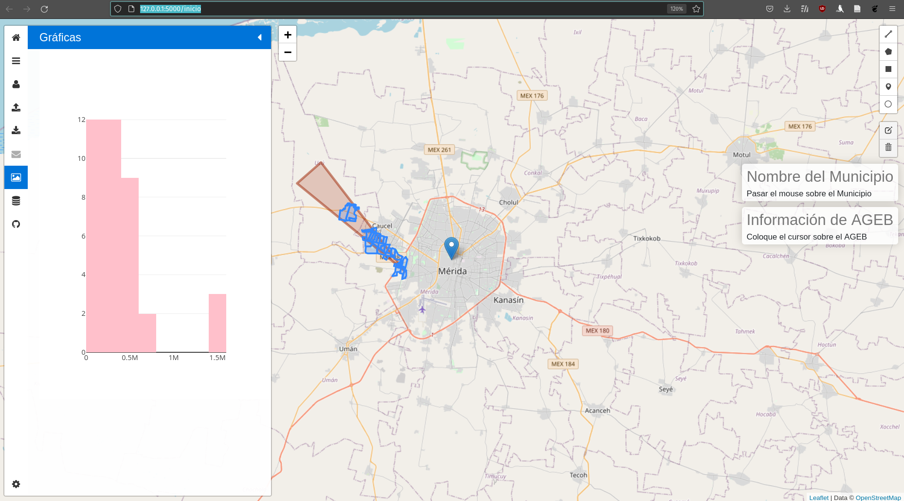

# Instalación

## Configuración de la base de datos

Instalar postgres y postgis:

```
sudo apt install postgresql postgresql-contrib
sudo apt install postgis postgresql-14-postgis-3
```
Posteriormente entrar a psql como el usuario postgres:

```
sudo -i -u postgres
psql
```

Y crear un nuevo usuario con su respectiva contraseña:

```
CREATE ROLE fidel LOGIN SUPERUSER PASSWORD 'fidel_pw';
```

Para crear la base de datos entrar a psql o PGAdmin con el usuario recien creado y correr el siguiente código SQL:

```
CREATE DATABASE dbagebsyucatan;
```

El paso siguiente es subir los datos de un shapefile y dos csvs, para lo cual en PGadmin conectarse a la base de datos dbagebsyucatan con el usuario recien creado, abrir la herramienta de query y cargar y correr los siguientes archivos con código sql:

yucAgebsAppRest/data/yucAgebs/dbagebsyucatan.sql

yucAgebsAppRest/data/yucConevalMun/yuc_coneval.sql

yucAgebsAppRest/data/yucMunicipios/tbmuninicipiosyucatan.sql

## Instalación de bibliotecas de python

En caso de haber creado un ambiente virtual de python primero hay que activar el ambiente virtual con el siguiente comando:

```
source venv/bin/activate
```

Para instalar las bibliotecas necesarias para esta aplicación, correr el siguiente comando:

```
pip3 install requirements.txt
```


## Activar el servicio REST

Para activar el servicio REST que calcula las intersecciones y devuelve un geojson:

```
cd yucAgebsAppRest
python3 app.py
```

Esto expondrá un API en el puerto 4000, se puede comprobar su funcionamiento con:

```
localhost:4000/fomix/api/v0.1/municipios/coneval/2010/nopob_novul
```

## Activar el app del cliente para browser

Para iniciar la aplicación que consumirá el servicio REST, en una nueva consola entrar a la carpeta yucAgebsAppV00 y correr app.py:

```
cd yucAgebsAppV00
python3 app.py
```

Para usar la aplicación abrir el siguiente url en un navegador:

http://127.0.0.1:5000/inicio



