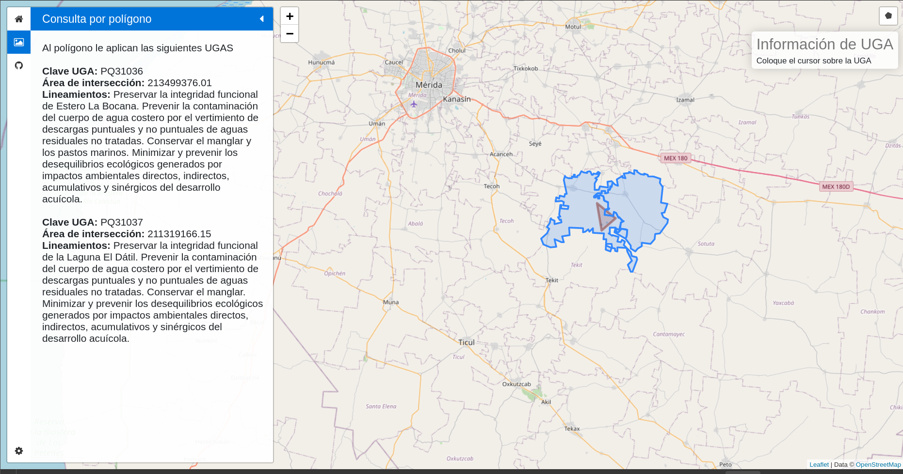

# Instalación

## Configuración de la base de datos

Instalar postgres y postgis:

```
sudo apt install postgresql postgresql-contrib
sudo apt install postgis postgresql-14-postgis-3
```
Posteriormente entrar a psql como el usuario postgres:

```
sudo -i -u postgres
psql
```

Y crear un nuevo usuario con su respectiva contraseña:

```
CREATE ROLE fidel LOGIN SUPERUSER PASSWORD 'fidel_pw';
```

Para crear la base de datos entrar a psql o PGAdmin con el usuario recien creado y correr el siguiente código SQL:

```
CREATE DATABASE dbagebsyucatan;
```

El paso siguiente es subir los datos de un shapefile en PGadmin, para lo cual se puede abrir en QGIS la capa geográfica:

```
rest/data/yucMunicipios/ugas.geojson
```

Desde QGIS con la capa abierta conectarse a Postgis con el usuario y contraseña generados anteriormente. Abrir el menu BDManager de QGIS, seleccionar la conección a Postgis e importar la capa ugas.geojson directamante a Postgis.

## Instalación de bibliotecas de python

Crear un ambiente virtual de Python con el siguiente comando:

```
virtualenv venv
```

Activar el ambiente virtual con el siguiente comando:

```
source venv/bin/activate
```

Para instalar las bibliotecas necesarias para esta aplicación, correr el siguiente comando:

```
pip3 install requirements.txt
```


## Activar el servicio REST

Para activar el servicio REST que calcula las intersecciones y devuelve un geojson:

```
source venv/bin/activate
cd rest
python3 app.py
```

Esto expondrá un API en el puerto 4000

## Activar el app del cliente para browser

Para iniciar la aplicación que consumirá el servicio REST, en una nueva consola, activar el ambiente virtual, entrar a la carpeta client y correr app.py:

```
source venv/bin/activate
cd client
python3 app.py
```

Para usar la aplicación abrir el siguiente url en un navegador:

http://127.0.0.1:5000/inicio



